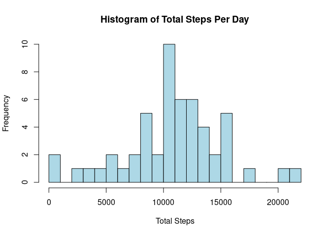
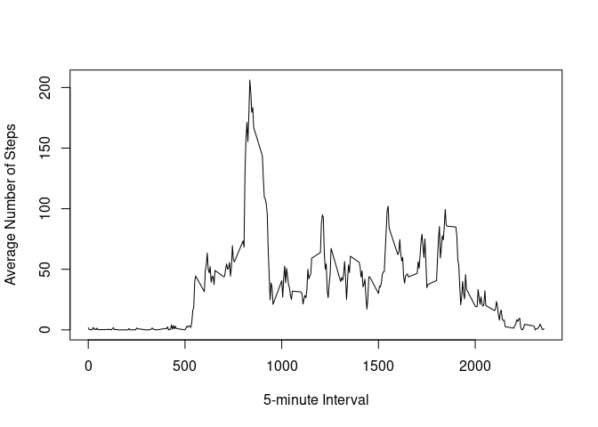
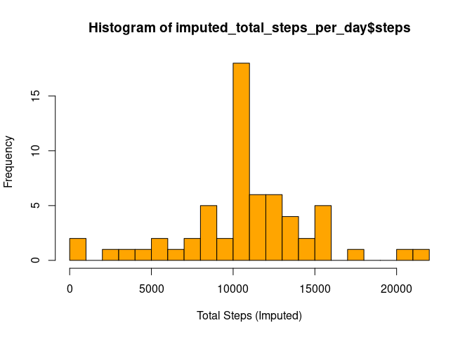
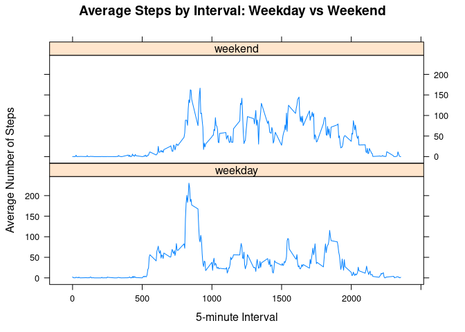

## Loading and preprocessing the data
First, we load the data and view the first rows.


```r
data <- read.csv("../Reproducible Research/week2/activity.csv")
head(data)
```

```
##   steps       date interval
## 1    NA 2012-10-01        0
## 2    NA 2012-10-01        5
## 3    NA 2012-10-01       10
## 4    NA 2012-10-01       15
## 5    NA 2012-10-01       20
## 6    NA 2012-10-01       25
```

## What is mean total number of steps taken per day?
To analyze the mean total number of steps taken per day, we first calculate the total steps for each day, ignoring missing values.

```r
total_steps_per_day <- aggregate(steps ~ date, data = data, sum, na.rm = TRUE)
```

Below is a histogram showing the distribution of the total number of steps taken each day.


```r
hist(total_steps_per_day$steps, 
     main = "Histogram of Total Steps Per Day",
     xlab = "Total Steps",
     col = "lightblue",
     breaks = 20)
```

<!-- -->
Next, we calculate the mean and median of the total numbers of steps taken per day. 


```r
mean_steps <- mean(total_steps_per_day$steps)
median_steps <- median(total_steps_per_day$steps)
```


```r
mean_steps
```

```
## [1] 10766.19
```

```r
median_steps
```

```
## [1] 10765
```

## What is the average daily activity pattern?
To analyze the avarage daily activity pattern, we calculate the average number of steps for each 5-minute interval accross all days, and then plot this as a time series.

First we calculate the average steps for eacht interval.


```r
average_steps_interval <- aggregate(steps ~ interval, data = data, mean, na.rm = TRUE)
```

Now, we make a time-series plot.


```r
plot(average_steps_interval$interval, 
     average_steps_interval$steps, 
     type = "l",
     xlab = "5-minute Interval", 
     ylab = "Average Number of Steps")
```

<!-- -->

Find the interval with the maximum average steps.


```r
max_interval <- average_steps_interval[which.max(average_steps_interval$steps), ]
```


```r
max_interval
```

```
##     interval    steps
## 104      835 206.1698
```

## Imputing missing values

We calculate the total number of missing values


```r
num_missing <- sum(is.na(data$steps))
num_missing
```

```
## [1] 2304
```

We are going to replace each missing steps value with the mean for that 5-minute interval (calculated across all days)

First, we create a named vector of interval means.


```r
interval_means <- tapply(data$steps, data$interval, mean, na.rm = TRUE)
```

Then, we copy the original data.

```r
imputed_data <- data
```

Fill in the missing 'steps' with the mean for that interval.


```r
imputed_data$steps[is.na(imputed_data$steps)] <- interval_means[as.character(imputed_data$interval[is.na(imputed_data$steps)])]
```

Now we make a histogram again with the imputed data.

First calculate the total steps per day.

```r
imputed_total_steps_per_day <- aggregate(steps ~ date, data = imputed_data, sum)
```

Plot the histogram.

```r
hist(imputed_total_steps_per_day$steps,
     xlab = "Total Steps (Imputed)",
     col = "orange",
     breaks = 20)
```

<!-- -->

Next, we calculate the mean and median of the total numbers of steps taken per day. 


```r
imputed_mean_steps <- mean(imputed_total_steps_per_day$steps)
imputed_median_steps <- median(imputed_total_steps_per_day$steps)
```


```r
imputed_mean_steps
```

```
## [1] 10766.19
```

```r
imputed_median_steps
```

```
## [1] 10766.19
```

The mean is unchanged after imputing missing data, but the median increases slightly to match the mean. Imputing missing values with the interval mean reduces variability and makes the distribution of total daily steps more regular, but does not significantly affect the overall average.

## Are there differences in activity patterns between weekdays and weekends?

First, we create a new variable indicating weekday or weekend  

Convert the variable date to date class 


```r
imputed_data$date <- as.Date(imputed_data$date)
```

Create a the new variable 

```r
imputed_data$day_type <- ifelse(weekdays(imputed_data$date) %in% c("Saturday", "Sunday"), 
                                "weekend", "weekday")
```

Make the variable a factor for plotting

```r
imputed_data$day_type <- factor(imputed_data$day_type, levels = c("weekday", "weekend"))
```

We are going to make a Make a panel plot containing a time series plot of the 5-minute interval (x-axis) and the average number of steps taken, averaged across all weekday days or weekend days (y-axis)

First, calculate the mean steps for each interval and day type 

```r
library(dplyr)
```

```
## 
## Attaching package: 'dplyr'
```

```
## The following objects are masked from 'package:stats':
## 
##     filter, lag
```

```
## The following objects are masked from 'package:base':
## 
##     intersect, setdiff, setequal, union
```

```r
interval_daytype <- imputed_data %>%
  group_by(interval, day_type) %>%
  summarize(average_steps = mean(steps), .groups = "drop")
```

Make the plot


```r
library(lattice)
xyplot(average_steps ~ interval | day_type, data = interval_daytype, 
       type = "l",
       layout = c(1, 2), 
       xlab = "5-minute Interval", 
       ylab = "Average Number of Steps",
       main = "Average Steps by Interval: Weekday vs Weekend")
```

<!-- -->

The panel plot shows that activity patterns differ between weekdays and weekends. On weekends, people tend to have a higher and more consistent average number of steps throughout the day. On weekdays, there is a pronounced peak in activity during the morning hours (around 5:00 to 10:00 AM), likely corresponding to typical work or school routines. This suggests that weekday activity is more concentrated in the morning, while weekend activity is more evenly distributed.
